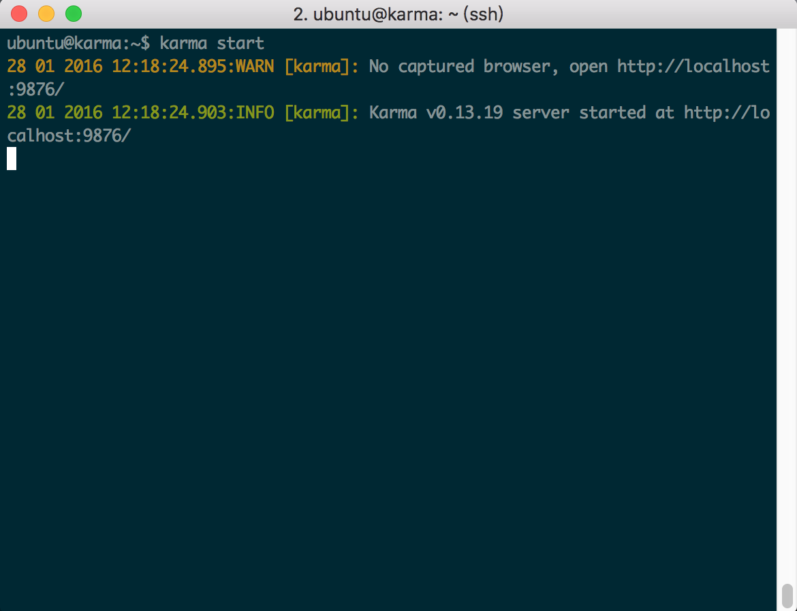

## Karma

### 作業系統：
* ubuntu 14.04

### Node.js 安裝：
使用 `curl` 取得安裝檔案，並且透過 `apt-get install nodejs`安裝此套件。

```
curl -sL https://deb.nodesource.com/setup_4.x | sudo -E bash -

apt-get install nodejs
```

安裝完後，透過 `node --version` 命令查詢版本並確認安裝成功。

```
node --version

#v4.2.6  成功可以看到版本 
```

### Karma 安裝：

使用 `npm install karma --save-dev` 指令安裝 Karma 套件。

```
npm install karma --save-dev
```

安裝 jasmine framework 與 PhantomJS。

```
sudo npm install karma-jasmine karma-phantomjs-launcher --save-dev
```

啟動 Karma：

```
./node_modules/karma/bin/karma start
```

官方提供另一個執行 Karam 的方式，需要安裝 `karma-cli` ，這個套件的好處是每次執行只需要輸入 `karma start` 就可以執行測試，不必輸入冗長的指令。

```
npm install -g karma-cli
```
>執行語法 ： karma start

### 結果：

